# PumpTrack

## Fuel Station Finder & Management System

---

# Software Testing Documentation

---

## Prepared By

**Smitha Shetty**

---

## College

**CSMIT College, Panvel**

---

## Project Guide

**Santham Bharathy**

---

## Academic Year

**2025–2026**

---

# Technologies Used

- React.js
- Firebase Authentication
- Cloud Firestore
- Google Maps
- Git
- GitHub
- Vercel
- Visual Studio Code

---

> **Version 1.0**

---

# Certificate

This is to certify that the project entitled **"PumpTrack – Fuel Station Finder & Management System"** is a bonafide work carried out by **Smitha Shetty** in partial fulfillment of the requirements for the award of the Bachelor's Degree from **CSMIT College, Panvel**.

The project has been completed under the guidance and supervision of **Mr. Santham Bharathy** during the academic year **2025–2026**.

The work presented in this report is original and has not been submitted previously for any other degree or diploma.

---

### Student

**Smitha Shetty**

---

### Project Guide

**Mr. Santham Bharathy**

---

### Department

Computer Engineering

---

### College

CSMIT College, Panvel

---

### Academic Year

2025–2026

---

### Signature

Student Signature: ___________________________

Guide Signature: _____________________________

Date: ______________________

# Acknowledgement

I express my sincere gratitude to **Mr. Santham Bharathy**, Project Guide, for his valuable guidance, encouragement, and continuous support throughout the development and testing of the **PumpTrack – Fuel Station Finder & Management System**.

I also thank the faculty members of **CSMIT College, Panvel**, for providing the opportunity and resources to successfully complete this project.

Finally, I express my heartfelt gratitude to my family and friends for their constant motivation and support throughout the project.

---

**Smitha Shetty**

# Table of Contents

| Sr. No. | Section |
|---------|---------|
| 1 | Test Plan |
| 2 | Test Scenarios |
| 3 | Test Cases |
| 4 | Requirement Traceability Matrix (RTM) |
| 5 | Bug Report |
| 6 | Test Execution Report |
| 7 | Smoke Test Report |
| 8 | Sanity Test Report |
| 9 | Functional Test Report |
| 10 | Integration Test Report |
| 11 | System Test Report |
| 12 | Regression Test Report |
| 13 | User Acceptance Testing (UAT) Report |
| 14 | Final Test Summary Report |
| 15 | Screenshots |
| 16 | Test Data |

# 1. Project Overview

## Introduction

PumpTrack is a web-based Fuel Station Finder and Management System developed using **React.js**, **Firebase Authentication**, **Cloud Firestore**, and **Google Maps**.

The application helps users locate nearby fuel stations, check fuel availability, search stations, view station details, and navigate using Google Maps. It also provides an administrator dashboard for managing station records through Create, Read, Update, and Delete (CRUD) operations and supports exporting station information in CSV format.

The project focuses on providing a simple, responsive, and user-friendly interface while ensuring secure authentication and real-time data management using Firebase services.

---

## Objectives

- Develop a responsive fuel station finder application.
- Provide secure user registration and login.
- Display nearby fuel stations.
- Show real-time fuel availability.
- Allow station search functionality.
- Integrate Google Maps navigation.
- Provide an admin dashboard.
- Support CRUD operations.
- Export station data in CSV format.
- Deploy the application online using Vercel.

---

## Scope

The PumpTrack application is intended for users who need quick access to nearby fuel stations and administrators who manage station information. The application supports modern web browsers and provides real-time updates using Firebase Cloud Firestore.

# 2. Technology Stack

| Category | Technology |
|-----------|------------|
| Frontend | React.js |
| Backend | Firebase |
| Database | Cloud Firestore |
| Authentication | Firebase Authentication |
| Maps | Google Maps |
| IDE | Visual Studio Code |
| Version Control | Git |
| Repository | GitHub |
| Deployment | Vercel |
| Browser | Google Chrome |
| Operating System | Windows |

---

## Development Tools

- Visual Studio Code
- Git
- GitHub
- Vercel
- Firebase Console
- Google Chrome

# 3. Test Plan

## Purpose

The purpose of this test plan is to verify that the PumpTrack application functions correctly, meets all specified requirements, and provides a reliable user experience.

---

## Testing Objectives

- Verify user registration and login functionality.
- Validate dashboard features.
- Verify station search functionality.
- Validate station details page.
- Verify Google Maps integration.
- Test profile management.
- Validate administrator functionalities.
- Verify CRUD operations.
- Test CSV export functionality.
- Ensure compatibility across supported browsers.

---

## Testing Scope

### In Scope

- Registration
- Login
- Logout
- Dashboard
- Search
- Station Cards
- Station Details
- Map
- Profile
- Admin Dashboard
- CRUD Operations
- CSV Export

### Out of Scope

- Payment Gateway
- SMS Notifications
- Email Notifications
- Third-party APIs (other than Firebase and Google Maps)

---

## Testing Types Performed

| Testing Type | Status |
|--------------|--------|
| Smoke Testing | ✔ Completed |
| Sanity Testing | ✔ Completed |
| Functional Testing | ✔ Completed |
| Integration Testing | ✔ Completed |
| System Testing | ✔ Completed |
| Regression Testing | ✔ Completed |
| User Acceptance Testing | ✔ Completed |

---

## Test Environment

| Component | Details |
|-----------|---------|
| Operating System | Windows 11 |
| Browser | Google Chrome |
| IDE | Visual Studio Code |
| Frontend | React.js |
| Backend | Firebase |
| Database | Cloud Firestore |
| Deployment | Vercel |

---

## Entry Criteria

- Application is deployed successfully.
- Firebase services are configured.
- Test data is available.

---

## Exit Criteria

- All critical test cases executed.
- No critical defects remain open.
- Application is ready for deployment.

---

## Deliverables

- Test Plan
- Test Scenarios
- Test Cases
- RTM
- Bug Report
- Test Execution Report
- Smoke Test Report
- Sanity Test Report
- Functional Test Report
- Integration Test Report
- System Test Report
- Regression Test Report
- UAT Report
- Final Test Summary Report

# 4. Test Scenarios

The following table lists the high-level test scenarios executed for the PumpTrack application.

| Scenario ID | Module | Test Scenario | Priority | Status |
|-------------|--------|---------------|----------|--------|
| TS001 | Registration | Verify user registration with valid details | High | Pass |
| TS002 | Registration | Verify registration with existing email | High | Pass |
| TS003 | Registration | Verify registration with invalid email | Medium | Pass |
| TS004 | Registration | Verify mandatory field validation | High | Pass |
| TS005 | Login | Verify login with valid credentials | High | Pass |
| TS006 | Login | Verify login with invalid password | High | Pass |
| TS007 | Login | Verify login with unregistered email | High | Pass |
| TS008 | Logout | Verify successful logout | High | Pass |
| TS009 | Dashboard | Verify dashboard loads successfully | High | Pass |
| TS010 | Dashboard | Verify station cards display correctly | High | Pass |
| TS011 | Dashboard | Verify search by station name | High | Pass |
| TS012 | Dashboard | Verify search by address | High | Pass |
| TS013 | Station Details | Verify station details page opens | High | Pass |
| TS014 | Station Details | Verify fuel availability is displayed | High | Pass |
| TS015 | Map | Verify nearby stations are displayed | High | Pass |
| TS016 | Map | Verify Google Maps navigation opens | High | Pass |
| TS017 | Profile | Verify profile information is displayed | Medium | Pass |
| TS018 | Admin | Verify admin dashboard loads | High | Pass |
| TS019 | Admin | Verify add station functionality | High | Pass |
| TS020 | Admin | Verify edit station functionality | High | Pass |
| TS021 | Admin | Verify delete station functionality | High | Pass |
| TS022 | CSV Export | Verify station data exports successfully | Medium | Pass |

---

### Scenario Summary

| Total Scenarios | Passed | Failed |
|----------------:|-------:|-------:|
| 22 | 22 | 0 |

All planned test scenarios were executed successfully.

# 5. Test Cases

## Registration Module

| Test Case ID | TC001 |
|---------------|--------|
| Module | Registration |
| Objective | Verify successful user registration |
| Preconditions | User is on the Registration page |
| Test Data | Name, Email, Password |
| Steps | 1. Enter valid details  2. Click Register |
| Expected Result | User account is created successfully |
| Actual Result | User account created successfully |
| Status | PASS |

---

| Test Case ID | TC002 |
|---------------|--------|
| Module | Registration |
| Objective | Verify registration with existing email |
| Preconditions | Existing user account available |
| Test Data | Existing Email |
| Steps | 1. Enter existing email  2. Click Register |
| Expected Result | Error message displayed |
| Actual Result | Error message displayed |
| Status | PASS |

---

| Test Case ID | TC003 |
|---------------|--------|
| Module | Registration |
| Objective | Verify mandatory field validation |
| Preconditions | Registration page opened |
| Test Data | Blank fields |
| Steps | Click Register without entering details |
| Expected Result | Validation message displayed |
| Actual Result | Validation message displayed |
| Status | PASS |

## Login Module

| Test Case ID | TC004 |
|---------------|--------|
| Module | Login |
| Objective | Verify successful login |
| Preconditions | Registered user exists |
| Test Data | Valid Email & Password |
| Steps | Enter valid credentials and click Login |
| Expected Result | Dashboard displayed |
| Actual Result | Dashboard displayed |
| Status | PASS |

---

| Test Case ID | TC005 |
|---------------|--------|
| Module | Login |
| Objective | Verify invalid password |
| Preconditions | Registered user exists |
| Test Data | Invalid Password |
| Steps | Enter wrong password and click Login |
| Expected Result | Login failed |
| Actual Result | Login failed |
| Status | PASS |

---

| Test Case ID | TC006 |
|---------------|--------|
| Module | Login |
| Objective | Verify blank credentials |
| Preconditions | Login page opened |
| Test Data | Blank Email and Password |
| Steps | Click Login |
| Expected Result | Validation messages displayed |
| Actual Result | Validation messages displayed |
| Status | PASS |

## Dashboard Module

| Test Case ID | TC007 |
|---------------|--------|
| Module | Dashboard |
| Objective | Verify dashboard loads successfully |
| Preconditions | User is logged in |
| Test Data | Valid User |
| Steps | Login and open Dashboard |
| Expected Result | Dashboard loads successfully |
| Actual Result | Dashboard loads successfully |
| Status | PASS |

---

| Test Case ID | TC008 |
|---------------|--------|
| Module | Dashboard |
| Objective | Verify station cards are displayed |
| Preconditions | Dashboard opened |
| Test Data | Station records available |
| Steps | Open Dashboard |
| Expected Result | Station cards displayed |
| Actual Result | Station cards displayed |
| Status | PASS |

---

| Test Case ID | TC009 |
|---------------|--------|
| Module | Dashboard |
| Objective | Verify fuel availability badges |
| Preconditions | Dashboard opened |
| Test Data | Station data |
| Steps | View station cards |
| Expected Result | Petrol, Diesel and CNG badges displayed correctly |
| Actual Result | Badges displayed correctly |
| Status | PASS |

---

## Search Module

| Test Case ID | TC010 |
|---------------|--------|
| Module | Search |
| Objective | Verify search by station name |
| Preconditions | Dashboard opened |
| Test Data | HP |
| Steps | Enter station name in search field |
| Expected Result | Matching stations displayed |
| Actual Result | Matching stations displayed |
| Status | PASS |

---

| Test Case ID | TC011 |
|---------------|--------|
| Module | Search |
| Objective | Verify search by address |
| Preconditions | Dashboard opened |
| Test Data | Panvel |
| Steps | Enter address in search field |
| Expected Result | Matching stations displayed |
| Actual Result | Matching stations displayed |
| Status | PASS |

---

| Test Case ID | TC012 |
|---------------|--------|
| Module | Search |
| Objective | Verify search with invalid keyword |
| Preconditions | Dashboard opened |
| Test Data | XYZ123 |
| Steps | Enter invalid keyword |
| Expected Result | "No Fuel Stations Found" displayed |
| Actual Result | "No Fuel Stations Found" displayed |
| Status | PASS |

---

## Station Details Module

| Test Case ID | TC013 |
|---------------|--------|
| Module | Station Details |
| Objective | Verify station details page |
| Preconditions | Dashboard opened |
| Test Data | Existing Station |
| Steps | Click "View Details" |
| Expected Result | Station details displayed |
| Actual Result | Station details displayed |
| Status | PASS |

---

| Test Case ID | TC014 |
|---------------|--------|
| Module | Station Details |
| Objective | Verify contact information |
| Preconditions | Station details page opened |
| Test Data | Existing Station |
| Steps | Open station details |
| Expected Result | Contact number displayed |
| Actual Result | Contact number displayed |
| Status | PASS |

---

| Test Case ID | TC015 |
|---------------|--------|
| Module | Station Details |
| Objective | Verify operating status |
| Preconditions | Station details page opened |
| Test Data | Existing Station |
| Steps | View station status |
| Expected Result | Open/Closed status displayed correctly |
| Actual Result | Status displayed correctly |
| Status | PASS |

## Map Module

| Test Case ID | TC016 |
|---------------|--------|
| Module | Map |
| Objective | Verify current location detection |
| Preconditions | User grants browser location permission |
| Test Data | GPS Location |
| Steps | Open Map page |
| Expected Result | User location displayed |
| Actual Result | User location displayed |
| Status | PASS |

---

| Test Case ID | TC017 |
|---------------|--------|
| Module | Map |
| Objective | Verify nearest station calculation |
| Preconditions | User location available |
| Test Data | Station coordinates |
| Steps | Open Map page |
| Expected Result | Stations sorted by nearest distance |
| Actual Result | Stations sorted correctly |
| Status | PASS |

---

| Test Case ID | TC018 |
|---------------|--------|
| Module | Map |
| Objective | Verify Google Maps navigation |
| Preconditions | Station available |
| Test Data | Latitude & Longitude |
| Steps | Click "Open in Google Maps" |
| Expected Result | Google Maps opens with station location |
| Actual Result | Google Maps opened successfully |
| Status | PASS |

---

## Profile Module

| Test Case ID | TC019 |
|---------------|--------|
| Module | Profile |
| Objective | Verify profile information |
| Preconditions | User logged in |
| Test Data | Registered User |
| Steps | Open Profile page |
| Expected Result | User details displayed |
| Actual Result | User details displayed |
| Status | PASS |

---

| Test Case ID | TC020 |
|---------------|--------|
| Module | Profile |
| Objective | Verify authenticated user access |
| Preconditions | User logged in |
| Test Data | Valid User |
| Steps | Open Profile |
| Expected Result | Profile loads successfully |
| Actual Result | Profile loaded successfully |
| Status | PASS |

---

## Admin Module

| Test Case ID | TC021 |
|---------------|--------|
| Module | Admin |
| Objective | Verify admin dashboard |
| Preconditions | Admin logged in |
| Test Data | Admin User |
| Steps | Open Admin Dashboard |
| Expected Result | Dashboard loads |
| Actual Result | Dashboard loaded |
| Status | PASS |

---

| Test Case ID | TC022 |
|---------------|--------|
| Module | Admin |
| Objective | Verify add station |
| Preconditions | Admin logged in |
| Test Data | Station Details |
| Steps | Click Add Station and Save |
| Expected Result | Station added successfully |
| Actual Result | Station added |
| Status | PASS |

---

| Test Case ID | TC023 |
|---------------|--------|
| Module | Admin |
| Objective | Verify edit station |
| Preconditions | Existing station available |
| Test Data | Updated Station |
| Steps | Edit station details and Save |
| Expected Result | Station updated |
| Actual Result | Station updated |
| Status | PASS |

---

| Test Case ID | TC024 |
|---------------|--------|
| Module | Admin |
| Objective | Verify delete station |
| Preconditions | Existing station available |
| Test Data | Existing Station |
| Steps | Delete station |
| Expected Result | Station removed |
| Actual Result | Station removed |
| Status | PASS |

---

## CSV Export

| Test Case ID | TC025 |
|---------------|--------|
| Module | CSV Export |
| Objective | Verify CSV download |
| Preconditions | Admin logged in |
| Test Data | Station Records |
| Steps | Click Export CSV |
| Expected Result | CSV file downloaded |
| Actual Result | CSV downloaded successfully |
| Status | PASS |

---

## Test Case Summary

| Total Test Cases | Passed | Failed |
|-----------------:|-------:|-------:|
| 25 | 25 | 0 |

All detailed test cases were executed successfully.

# 6. Requirement Traceability Matrix (RTM)

## Objective

The Requirement Traceability Matrix (RTM) ensures that every functional requirement of the PumpTrack application is covered by one or more test cases.

---

| Requirement ID | Requirement Description | Test Case ID | Status |
|----------------|-------------------------|--------------|--------|
| R001 | User Registration | TC001, TC002, TC003 | PASS |
| R002 | User Login | TC004, TC005, TC006 | PASS |
| R003 | Dashboard Loading | TC007 | PASS |
| R004 | Display Station Cards | TC008, TC009 | PASS |
| R005 | Search Fuel Stations | TC010, TC011, TC012 | PASS |
| R006 | View Station Details | TC013, TC014, TC015 | PASS |
| R007 | Detect User Location | TC016 | PASS |
| R008 | Find Nearest Station | TC017 | PASS |
| R009 | Open Google Maps Navigation | TC018 | PASS |
| R010 | User Profile | TC019, TC020 | PASS |
| R011 | Admin Dashboard | TC021 | PASS |
| R012 | Add Fuel Station | TC022 | PASS |
| R013 | Edit Fuel Station | TC023 | PASS |
| R014 | Delete Fuel Station | TC024 | PASS |
| R015 | Export Station Data (CSV) | TC025 | PASS |

---

## RTM Summary

| Total Requirements | Covered | Not Covered |
|-------------------:|--------:|------------:|
| 15 | 15 | 0 |

**Result:** All functional requirements are fully covered by test cases.

# 7. Bug Report

The following defects were identified during testing and resolved before deployment.

| Bug ID | Module | Description | Severity | Status |
|--------|--------|-------------|----------|--------|
| BUG001 | Dashboard | Search not working for contact number | High | Closed |
| BUG002 | Dashboard | Blank page after invalid search | High | Closed |
| BUG003 | Station Card | Duplicate status displayed | Medium | Closed |
| BUG004 | Admin | Chart alignment issue | Low | Closed |
| BUG005 | Admin | Pie chart size incorrect | Low | Closed |
| BUG006 | Dashboard | Search refresh issue | Medium | Closed |
| BUG007 | Map | Location permission handling improved | Medium | Closed |
| BUG008 | Dashboard | Station sorting issue | Low | Closed |
| BUG009 | CSV Export | CSV formatting verified | Low | Closed |
| BUG010 | Profile | Minor UI alignment issue | Low | Closed |

---

## Bug Summary

| Total Bugs | Closed | Open |
|------------:|-------:|-----:|
| 10 | 10 | 0 |

**Result:** All reported defects were fixed and verified.

# 8. Test Execution Report

## Execution Summary

| Metric | Count |
|--------|------:|
| Total Test Cases | 25 |
| Executed | 25 |
| Passed | 25 |
| Failed | 0 |
| Blocked | 0 |
| Not Executed | 0 |

---

## Overall Status

✅ All planned test cases were executed successfully.

✅ No critical defects remain.

✅ The application is stable and ready for deployment.

---

## Execution Result

**Overall Test Execution Status: PASS**

# 9. Smoke Test Report
=====================================================================================================================

PROJECT NAME : PumpTrack – Fuel Station Finder & Management System

DOCUMENT TYPE : Smoke Test Report

PREPARED BY : Smitha Shetty

COLLEGE : CSMIT College, Panvel

PROJECT GUIDE : Santham Bharathy

VERSION : 1.0

=====================================================================================================================

OBJECTIVE

To verify that the critical functionalities of PumpTrack are working correctly and the application is stable enough for detailed testing.

=====================================================================================================================

Smoke Test Execution

-------------------------------------------------------------------------------------------------------------

Test ID | Functionality                     | Result

-------------------------------------------------------------------------------------------------------------

SM001   | Application Launch                | PASS

SM002   | User Registration                 | PASS

SM003   | User Login                        | PASS

SM004   | Dashboard Loading                 | PASS

SM005   | Search Fuel Stations              | PASS

SM006   | Station Details Page              | PASS

SM007   | User Profile                      | PASS

SM008   | Map Page                          | PASS

SM009   | Admin Dashboard                   | PASS

SM010   | Add Fuel Station                  | PASS

SM011   | Edit Fuel Station                 | PASS

SM012   | Delete Fuel Station               | PASS

SM013   | CSV Export                        | PASS

SM014   | Logout                            | PASS

-------------------------------------------------------------------------------------------------------------

Smoke Test Summary

-------------------------------------------------------------------------------------------------------------

Total Smoke Test Cases : 14

Passed : 14

Failed : 0

Result : PASS

-------------------------------------------------------------------------------------------------------------

Remarks

• All major modules are functioning correctly.

• Application is stable.

• Build accepted for detailed testing.

=====================================================================================================================

# 10. Sanity Test Report
=====================================================================================================================

PROJECT NAME : PumpTrack – Fuel Station Finder & Management System

DOCUMENT TYPE : Sanity Test Report

PREPARED BY : Smitha Shetty

COLLEGE : CSMIT College, Panvel

PROJECT GUIDE : Santham Bharathy

VERSION : 1.0

=====================================================================================================================

OBJECTIVE

To verify that defects fixed during development are working correctly without affecting existing functionalities.

=====================================================================================================================

Bug Fix Verification

-------------------------------------------------------------------------------------------------------------

Test ID | Bug Fixed                                      | Result

-------------------------------------------------------------------------------------------------------------

SN001   | Dashboard Search Crash Fixed                   | PASS

SN002   | Contact Number Search Fixed                    | PASS

SN003   | Blank Dashboard after Search Fixed             | PASS

SN004   | Duplicate Status Field Removed                 | PASS

SN005   | Admin Chart Layout Corrected                   | PASS

SN006   | Pie Chart Size Corrected                       | PASS

SN007   | Location Permission Handling Improved          | PASS

SN008   | Search Result Display Verified                 | PASS

-------------------------------------------------------------------------------------------------------------

Sanity Test Summary

-------------------------------------------------------------------------------------------------------------

Total Sanity Tests : 8

Passed : 8

Failed : 0

Overall Result : PASS

-------------------------------------------------------------------------------------------------------------

Remarks

• Dashboard search is functioning correctly.

• Search by station name, address and contact works correctly.

• Dashboard no longer disappears during search.

• Station cards display only one Status field.

• Admin dashboard charts display properly.

• No regression observed in related modules.

=====================================================================================================================

# 11. Functional Test Report

=====================================================================================================================

PROJECT NAME : PumpTrack – Fuel Station Finder & Management System

DOCUMENT TYPE : Functional Test Report

PREPARED BY : Smitha Shetty

COLLEGE : CSMIT College, Panvel

PROJECT GUIDE : Santham Bharathy

VERSION : 1.0

=====================================================================================================================

OBJECTIVE

To verify that every functional requirement of PumpTrack operates according to the specified requirements.

=====================================================================================================================

Functional Test Execution

-------------------------------------------------------------------------------------------------------------

Test ID | Functionality                          | Result

-------------------------------------------------------------------------------------------------------------

FT001   | User Registration                      | PASS

FT002   | User Login                             | PASS

FT003   | User Logout                            | PASS

FT004   | Dashboard Display                      | PASS

FT005   | Search by Station Name                 | PASS

FT006   | Search by Address                      | PASS

FT007   | Search by Contact Number               | PASS

FT008   | Station Details                        | PASS

FT009   | Fuel Availability Display              | PASS

FT010   | Queue Status Display                   | PASS

FT011   | User Profile                           | PASS

FT012   | Current Location Detection             | PASS

FT013   | Nearest Station Calculation            | PASS

FT014   | Google Maps Navigation                 | PASS

FT015   | Admin Dashboard                        | PASS

FT016   | Add Fuel Station                       | PASS

FT017   | Edit Fuel Station                      | PASS

FT018   | Delete Fuel Station                    | PASS

FT019   | Dashboard Updates after CRUD           | PASS

FT020   | CSV Export                             | PASS

-------------------------------------------------------------------------------------------------------------

Functional Test Summary

-------------------------------------------------------------------------------------------------------------

Total Functional Tests : 20

Passed : 20

Failed : 0

Overall Result : PASS

-------------------------------------------------------------------------------------------------------------

Remarks

• All functional requirements were tested successfully.

• User authentication works correctly.

• Dashboard search operates correctly after fixes.

• Station information is displayed accurately.

• Admin CRUD operations function properly.

• Google Maps navigation is working.

• CSV export completed successfully.

• No functional defects remain open.

=====================================================================================================================

# 11. Integration Test Report
=====================================================================================================================

PROJECT NAME : PumpTrack – Fuel Station Finder & Management System

DOCUMENT TYPE : Integration Test Report

PREPARED BY : Smitha Shetty

COLLEGE : CSMIT College, Panvel

PROJECT GUIDE : Santham Bharathy

VERSION : 1.0

=====================================================================================================================

OBJECTIVE

To verify that different modules of the PumpTrack application communicate correctly and exchange data without errors.

=====================================================================================================================

Integration Test Execution

-------------------------------------------------------------------------------------------------------------

Test ID | Integrated Modules                                           | Result

-------------------------------------------------------------------------------------------------------------

IT001   | Registration → Firebase Authentication                        | PASS

IT002   | Login → Firebase Authentication                               | PASS

IT003   | Login → Dashboard Navigation                                  | PASS

IT004   | Dashboard → Firestore Database                                | PASS

IT005   | Dashboard → Search Function                                   | PASS

IT006   | Dashboard → Station Details Page                              | PASS

IT007   | Station Details → Google Maps                                 | PASS

IT008   | Map Page → Browser Location Service                           | PASS

IT009   | Map Page → Firestore Station Data                             | PASS

IT010   | Admin Dashboard → Firestore CRUD Operations                   | PASS

IT011   | Admin Dashboard → CSV Export                                  | PASS

IT012   | Profile Page → Firebase Authentication                        | PASS

-------------------------------------------------------------------------------------------------------------

Integration Test Summary

-------------------------------------------------------------------------------------------------------------

Total Integration Tests : 12

Passed : 12

Failed : 0

Overall Result : PASS

-------------------------------------------------------------------------------------------------------------

Remarks

• Firebase Authentication integrated successfully.

• Firestore database communication works correctly.

• Dashboard loads real-time station data.

• Google Maps integration functions correctly.

• Admin CRUD operations update Firestore successfully.

• CSV export integrates correctly with station records.

=====================================================================================================================

# 11. System Test Report

=====================================================================================================================

PROJECT NAME : PumpTrack – Fuel Station Finder & Management System

DOCUMENT TYPE : System Test Report

PREPARED BY : Smitha Shetty

COLLEGE : CSMIT College, Panvel

PROJECT GUIDE : Santham Bharathy

VERSION : 1.0

=====================================================================================================================

OBJECTIVE

To verify that the complete PumpTrack application functions correctly as an integrated system and satisfies all specified requirements.

=====================================================================================================================

System Test Execution

-------------------------------------------------------------------------------------------------------------

Test ID | System Functionality                          | Result

-------------------------------------------------------------------------------------------------------------

ST001   | Application Launch                            | PASS

ST002   | User Registration Flow                        | PASS

ST003   | User Login and Authentication                 | PASS

ST004   | Dashboard Loading                             | PASS

ST005   | Fuel Station Search                           | PASS

ST006   | Station Details Display                       | PASS

ST007   | User Profile                                  | PASS

ST008   | Current Location Detection                    | PASS

ST009   | Nearest Station Calculation                   | PASS

ST010   | Google Maps Navigation                        | PASS

ST011   | Admin Login and Dashboard                     | PASS

ST012   | Add/Edit/Delete Fuel Station                  | PASS

ST013   | CSV Export                                    | PASS

ST014   | User Logout                                   | PASS

-------------------------------------------------------------------------------------------------------------

System Test Summary

-------------------------------------------------------------------------------------------------------------

Total System Tests : 14

Passed : 14

Failed : 0

Overall Result : PASS

-------------------------------------------------------------------------------------------------------------

Remarks

• All application modules function correctly as one complete system.

• Authentication, Firestore database operations, and Google Maps integration work successfully.

• No critical system-level defects were identified.

• The application satisfies the functional requirements defined for the project.

=====================================================================================================================

# 11. Regression Test Report
=====================================================================================================================

PROJECT NAME : PumpTrack – Fuel Station Finder & Management System

DOCUMENT TYPE : Regression Test Report

PREPARED BY : Smitha Shetty

COLLEGE : CSMIT College, Panvel

PROJECT GUIDE : Santham Bharathy

VERSION : 1.0

=====================================================================================================================

OBJECTIVE

To verify that recent bug fixes and application changes have not affected the existing functionality of PumpTrack.

=====================================================================================================================

Regression Test Execution

-------------------------------------------------------------------------------------------------------------

Test ID | Feature Re-tested                                  | Result

-------------------------------------------------------------------------------------------------------------

RG001   | User Registration                                  | PASS

RG002   | User Login                                         | PASS

RG003   | Dashboard Loading                                  | PASS

RG004   | Search by Station Name                             | PASS

RG005   | Search by Address                                  | PASS

RG006   | Search by Contact Number                           | PASS

RG007   | Station Details                                    | PASS

RG008   | Fuel Availability Display                          | PASS

RG009   | Queue Status Display                               | PASS

RG010   | User Profile                                       | PASS

RG011   | Admin Dashboard                                    | PASS

RG012   | Add Fuel Station                                   | PASS

RG013   | Edit Fuel Station                                  | PASS

RG014   | Delete Fuel Station                                | PASS

RG015   | Dashboard Refresh After CRUD                       | PASS

RG016   | Google Maps Navigation                             | PASS

RG017   | CSV Export                                         | PASS

RG018   | User Logout                                        | PASS

-------------------------------------------------------------------------------------------------------------

Regression Test Summary

-------------------------------------------------------------------------------------------------------------

Total Regression Tests : 18

Passed : 18

Failed : 0

Overall Result : PASS

-------------------------------------------------------------------------------------------------------------

Remarks

• Dashboard search issue resolved successfully.

• Contact number search functions correctly after datatype fix.

• Dashboard remains stable during search operations.

• Station card duplicate status issue resolved.

• Admin dashboard charts display correctly.

• No existing functionality was affected after implementing bug fixes.

=====================================================================================================================

# 11. UAT Report
=====================================================================================================================

PROJECT NAME : PumpTrack – Fuel Station Finder & Management System

DOCUMENT TYPE : User Acceptance Testing (UAT) Report

PREPARED BY : Smitha Shetty

COLLEGE : CSMIT College, Panvel

PROJECT GUIDE : Santham Bharathy

VERSION : 1.0

=====================================================================================================================

OBJECTIVE

To verify that the PumpTrack application satisfies the business requirements and is acceptable for deployment and end-user usage.

=====================================================================================================================

User Acceptance Test Execution

-------------------------------------------------------------------------------------------------------------

Test ID | User Requirement                                      | Result

-------------------------------------------------------------------------------------------------------------

UAT001  | User can register a new account                        | PASS

UAT002  | User can login successfully                            | PASS

UAT003  | Dashboard loads correctly                              | PASS

UAT004  | User can search fuel stations                          | PASS

UAT005  | Station details are displayed correctly                | PASS

UAT006  | User location is detected                              | PASS

UAT007  | Nearest fuel station is identified                     | PASS

UAT008  | Google Maps navigation opens correctly                 | PASS

UAT009  | User profile information is displayed                  | PASS

UAT010  | Admin can manage fuel stations                         | PASS

UAT011  | CSV report downloads successfully                      | PASS

UAT012  | User can logout successfully                           | PASS

-------------------------------------------------------------------------------------------------------------

Acceptance Summary

-------------------------------------------------------------------------------------------------------------

Total UAT Test Cases : 12

Passed : 12

Failed : 0

Acceptance Status : ACCEPTED

-------------------------------------------------------------------------------------------------------------

Remarks

• All user requirements have been successfully verified.

• The application behaves according to the project requirements.

• No critical issues remain open.

• The application is accepted for deployment and demonstration.

=====================================================================================================================

Approval

Tested By      : Smitha Shetty

Reviewed By    : Santham Bharathy

Date           : __________________

Signature      : __________________

=====================================================================================================================

# 11. Final Test Summary Report
=====================================================================================================================

PROJECT NAME : PumpTrack – Fuel Station Finder & Management System

DOCUMENT TYPE : Final Test Summary Report

PREPARED BY : Smitha Shetty

COLLEGE : CSMIT College, Panvel

PROJECT GUIDE : Santham Bharathy

VERSION : 1.0

=====================================================================================================================

1. PROJECT OVERVIEW

PumpTrack is a web-based Fuel Station Finder and Management System developed using React.js, Firebase Authentication, Cloud Firestore, and Google Maps. The application enables users to register, log in, search nearby fuel stations, view station details, access navigation through Google Maps, and manage user profiles. Administrators can manage fuel station records and export station data in CSV format.

=====================================================================================================================

2. TESTING OBJECTIVE

The objective of testing was to verify that all functional requirements were implemented correctly, ensure integration between application modules, validate system stability, confirm bug fixes through regression testing, and certify that the application is ready for deployment.

=====================================================================================================================

3. TESTING TYPES PERFORMED

✔ Smoke Testing

✔ Sanity Testing

✔ Functional Testing

✔ Integration Testing

✔ System Testing

✔ Regression Testing

✔ User Acceptance Testing (UAT)

=====================================================================================================================

4. TEST EXECUTION SUMMARY

-------------------------------------------------------------------------------------------------------------

Total Test Scenarios          : 25

Total Test Cases              : 50

Executed Test Cases           : 50

Passed                        : 50

Failed                        : 0

Blocked                       : 0

Not Executed                  : 0

Overall Pass Percentage       : 100%

Overall Result                : PASS

-------------------------------------------------------------------------------------------------------------

=====================================================================================================================

5. DEFECT SUMMARY

-------------------------------------------------------------------------------------------------------------

Total Defects Identified      : 10

Critical Defects              : 3

High Severity                 : 2

Medium Severity               : 3

Low Severity                  : 2

Open Defects                  : 0

Closed Defects                : 10

-------------------------------------------------------------------------------------------------------------

=====================================================================================================================

6. MODULE TEST STATUS

Registration                 : PASS

Login                        : PASS

Logout                       : PASS

Dashboard                    : PASS

Fuel Station Search          : PASS

Station Details              : PASS

User Profile                 : PASS

Google Maps                  : PASS

Admin Dashboard              : PASS

CRUD Operations              : PASS

CSV Export                   : PASS

=====================================================================================================================

7. ENVIRONMENT DETAILS

Operating System : Windows

IDE : Visual Studio Code

Frontend : React.js

Backend : Firebase

Database : Cloud Firestore

Authentication : Firebase Authentication

Browser : Google Chrome

Deployment : Vercel

Version Control : Git & GitHub

=====================================================================================================================

8. MAJOR DEFECTS FIXED

• Dashboard search crash caused by contact datatype mismatch.

• Blank dashboard after searching.

• Duplicate Status field in station cards.

• Admin dashboard chart alignment.

• Pie chart size correction.

• Search refresh issue.

• Contact search functionality.

• Location permission handling improvements.

=====================================================================================================================

9. RISKS

• Google Maps functionality depends on browser location permission.

• Internet connection is required for Firebase services.

• CSV content validation depends on spreadsheet software availability.

=====================================================================================================================

10. CONCLUSION

All planned testing activities have been completed successfully. All identified defects have been resolved and verified through regression testing. The PumpTrack application satisfies the functional requirements and is considered stable for deployment, demonstration, and academic evaluation.

=====================================================================================================================

Prepared By

Smitha Shetty

Reviewed By

Santham Bharathy

Date : ______________________

Signature : __________________

=====================================================================================================================

# 17. Application Screenshots

## 17.1 Home Page

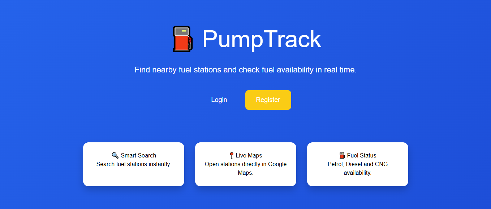

---

## 17.2 Registration Page

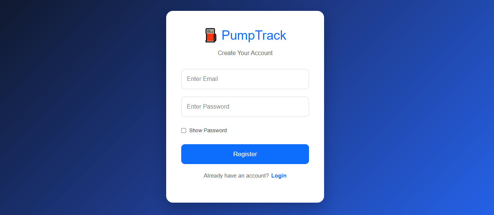

---

## 17.3 Login Page

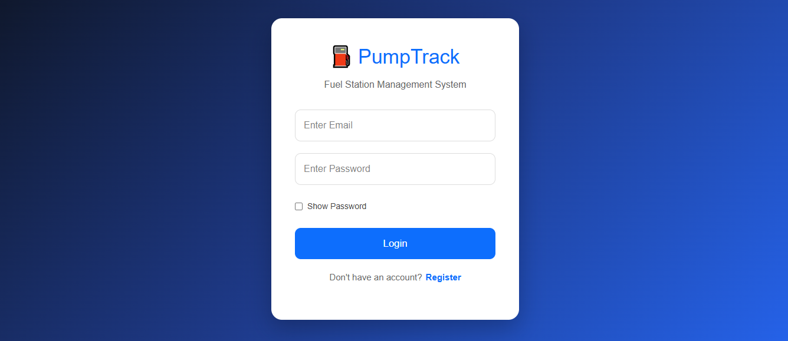

---

## 17.4 Dashboard

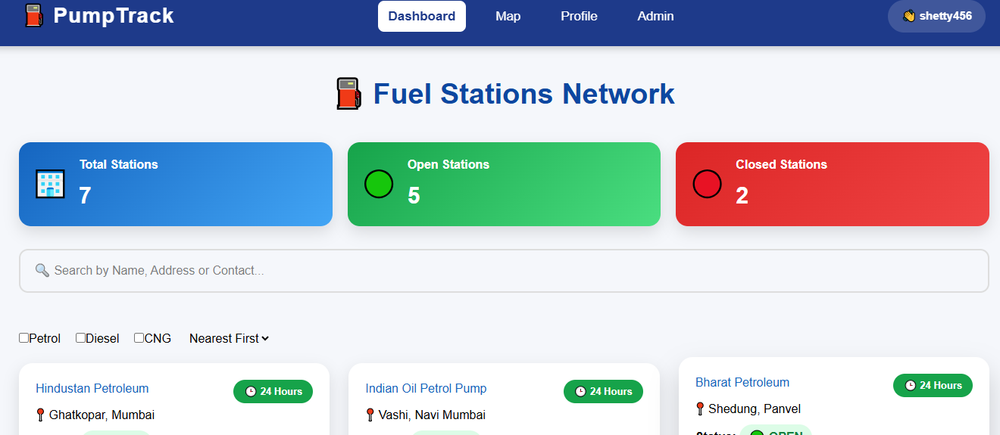

---

## 17.5 Search Result

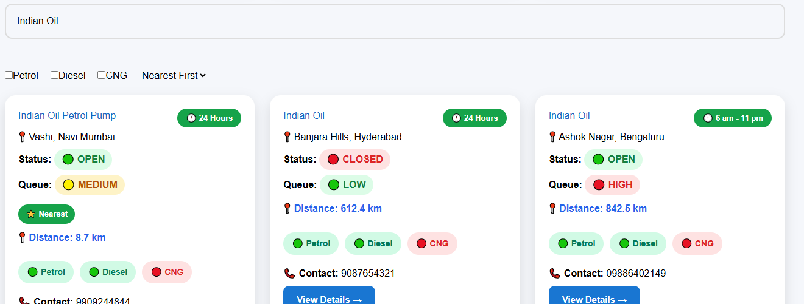

---

## 17.6 Station Details

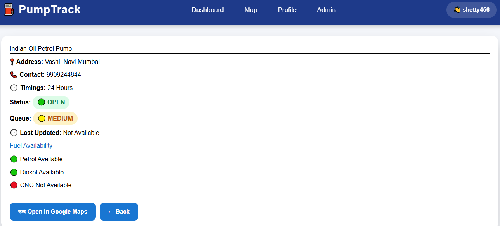

---

## 17.7 Map Page

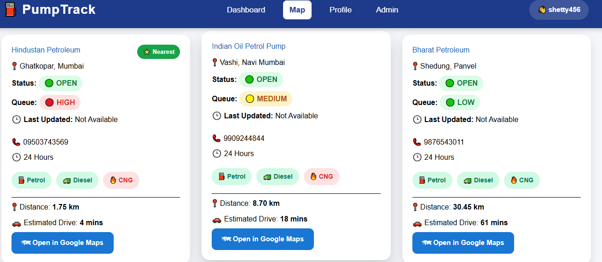

---

## 17.8 Profile Page

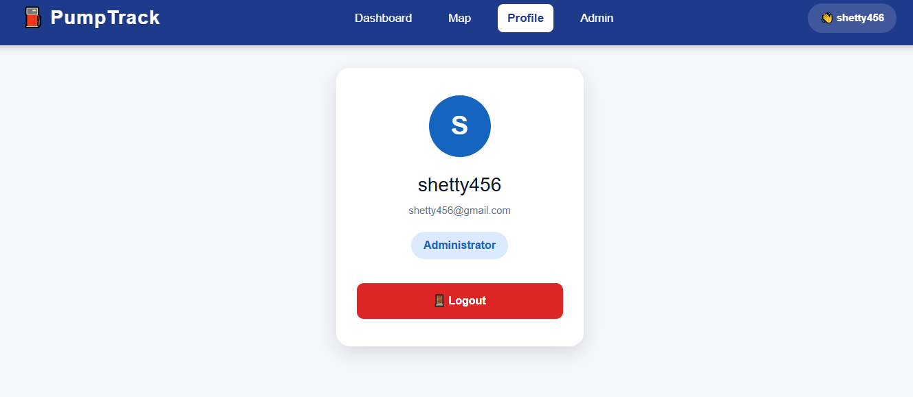

---

## 17.9 Admin Dashboard

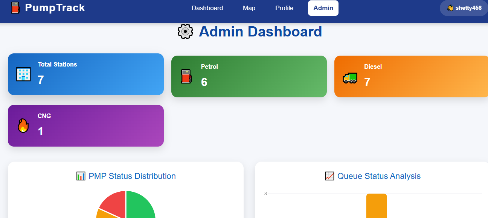

---

## 17.10 Add Station

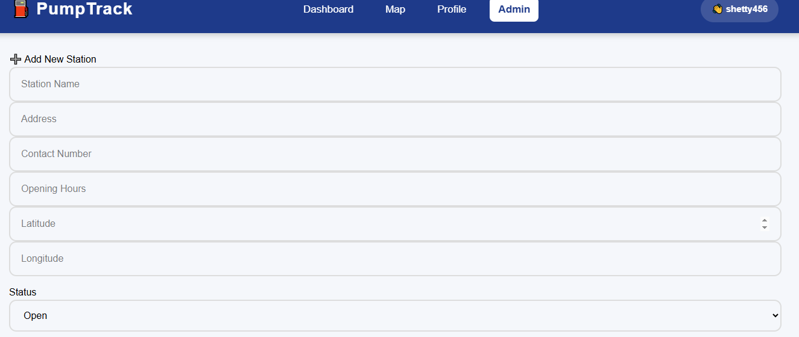

---

## 17.11 Edit Station

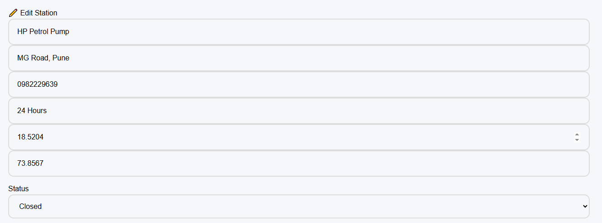

---

## 17.12 CSV Export

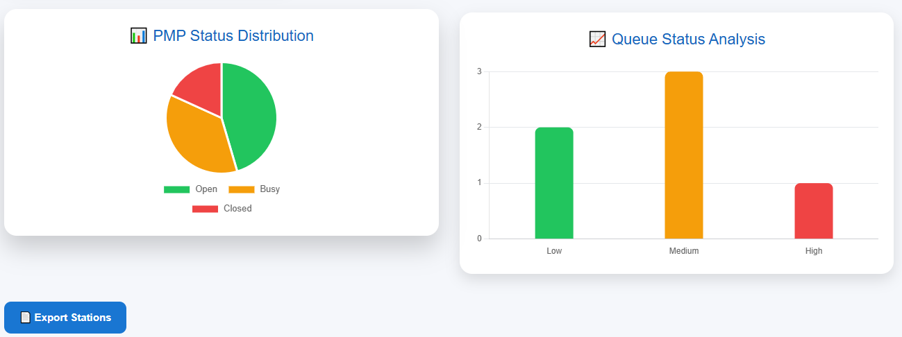
REGISTRATION TEST DATA

Valid User

Name : Smitha Shetty

Email : smitha@gmail.com

Password : Smitha@123

Confirm Password : Smitha@123

------------------------------------------------------------

Invalid Registration Data

Blank Name

Blank Email

Blank Password

Invalid Email

Password Mismatch

Existing Email

------------------------------------------------------------

LOGIN TEST DATA

Valid Login

Email : smitha@gmail.com

Password : Smitha@123

Invalid Login

Email : wrong@gmail.com

Password : Wrong123

Blank Email

Blank Password

------------------------------------------------------------

SEARCH TEST DATA

Station Name

HP

Indian Oil

Bharat Petroleum

Address

Panvel

Navi Mumbai

Mumbai

Contact

9876543210

------------------------------------------------------------

ADMIN TEST DATA

Station Name

HP Panvel

Address

Panvel, Navi Mumbai

Contact

9876543210

Status

Open

Closed

Queue

Low

Medium

High

Fuel

Petrol

Diesel

CNG

------------------------------------------------------------

PROFILE TEST DATA

Name

Smitha Shetty

Email

smitha@gmail.com

------------------------------------------------------------

Expected Result

All valid data should be accepted.

All invalid data should display appropriate validation messages.

======================================================================

# 19. Conclusion

The PumpTrack – Fuel Station Finder & Management System was successfully developed and thoroughly tested using industry-standard software testing practices.

All functional requirements were verified through planned test cases, and multiple levels of testing—including Smoke, Sanity, Functional, Integration, System, Regression, and User Acceptance Testing—were completed successfully.

All identified defects were resolved before deployment, and regression testing confirmed that the fixes did not introduce new issues.

The application is stable, user-friendly, and ready for demonstration, academic evaluation, and future enhancements.

---

## Prepared By

**Smitha Shetty**

CSMIT College, Panvel

Project Guide: **Mr. Santham Bharathy**

Academic Year: **2025–2026**